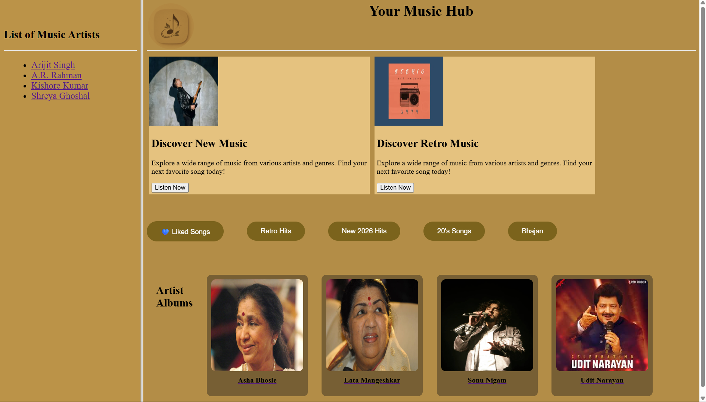

# 🎵 Music Web Application

## 📌 Project Title
**Music Web Application**

---

## 📖 About Project
This is a simple music web application where users can:
- View different music artists  
- Browse albums  
- Play songs  

The project is designed using **basic web technologies** and focuses on **frontend development concepts**.

---

## 🛠️ Technologies Used

| Category              | Technology   |
|:----------------------|:------------:|
| **Frontend (GUI)**    | HTML, CSS    |
| **Backend (Database)**| Not used     |
| **Server-side Script**| Not used     |
| **Client-side Script**| HTML & CSS   |

---

## 🔄 Flow Chart / Working of Project

User opens website
↓
Homepage loads (index.html)
↓
User selects artist from sidebar
↓
Artist page opens (songs list)
↓
User clicks "Play"
↓
Song player page opens

---

## 🖼️ Running Project (Screenshots)

🏠 **Home Page**  
- Displays main layout with sidebar and content  

🎤 **Artist Page**  
- Shows songs of selected artist  

▶️ **Play Page**  
- Plays selected song  

---

## 🚀 Future Enhancements
- Add more artists and songs  
- Improve UI (Spotify-like design)  
- Add JavaScript for better interaction  
- Make website mobile responsive  
- Add playlist and search feature  

---

## 🖼️ Running Project (Screenshots)

### 🏠 Home Page

---

## 📊 Data Flow Diagram (DFD)

User → Select Artist → View Songs → Play Song

---

## 📚 References
- Google (for images and learning)  
- YouTube tutorials  
- HTML & CSS documentation  

---

## 👨‍💻 Author
**Vijay Kumar Soni**
